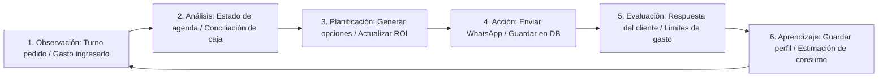

# Propuesta de Proyecto de Inteligencia Artificial (Entregable Oficial)
**Materia:** Inteligencia Artificial Aplicada a Organizaciones  
**Instancia:** Trabajo de Medio Ciclo  
**Proyecto:** SmartBarber Co-pilot — Sistema Agéntico de Gestión Operativa, Financiera y Turnos  

---

## 1. Descripción del Problema

El lanzamiento y la administración diaria de una barbería moderna presentan desafíos administrativos, contables y operativos que restan tiempo de atención al cliente y limitan la rentabilidad. Específicamente, este proyecto aborda un problema real que afecta al **dueño de la barbería** y a su **equipo de barberos**:

* **Gestión Ineficiente de Turnos:** Las solicitudes de reserva a través de canales de mensajería (WhatsApp, Instagram) requieren respuestas rápidas. La gestión manual o mediante agendas estáticas rígidas causa retrasos, colisiones de agenda y pérdida de clientes por falta de negociación ágil de horarios alternativos.
* **Complejidad y Desconfianza en las Liquidaciones:** El pago a los barberos se realiza según un esquema de comisiones variables (porcentaje de cada corte o servicio realizado). Llevar este registro de forma manual en planillas de papel o planillas Excel tradicionales es propenso a errores humanos, omisiones y fricciones internas.
* **Fuga de Información sobre Insumos:** Las compras de suministros de barbería (cuchillas, pomadas, champú, toallas, artículos de limpieza) suelen realizarse de manera informal o fragmentada. La falta de registro de estos gastos distorsiona el cálculo del margen neto real.
* **Desconexión con la Inversión Inicial (ROI):** La apertura del local requiere una inversión inicial clasificada (alquiler/depósito, mobiliario premium como sillones, espejos, refacciones de obra, cartelería e iluminación y herramientas profesionales). En la contabilidad habitual, esta inversión queda en un registro estático y no se asocia dinámicamente con las ganancias mensuales para visualizar de forma clara cuándo se alcanzará el **Punto de Equilibrio** (*Break-Even Point*).

**Importancia de Resolverlo:** Centralizar y automatizar de forma inteligente estas tareas operativas permite evitar pérdidas financieras, optimiza la ocupación de los barberos, garantiza transparencia en el pago de comisiones y proporciona al dueño una visión contable automatizada de la amortización de su capital invertido.

---

## 2. Objetivo de la Aplicación

La aplicación **SmartBarber Co-pilot** es un asistente agéntico inteligente diseñado para automatizar y optimizar la administración operativa, el front-desk y el control financiero de la barbería.

* **Qué hará la aplicación:** Coordinará a un enjambre de agentes especializados para interactuar con clientes, calendarizar reservas en base a agendas dinámicas, registrar compras de insumos analizando comprobantes mediante procesamiento de imagen/OCR, y calcular semanalmente la liquidación de cada barbero.
* **Resultados Esperados:** Reducción a cero de errores en comisiones, aumento del 15% en la ocupación de turnos a través de negociación conversacional proactiva, y control exacto en tiempo real del saldo pendiente de amortización de la inversión inicial.
* **Decisiones y Recomendaciones que Generará:**
  * Oferta dinámica de horarios alternativos a los clientes ante colisiones.
  * Alertas automáticas de bajo stock y sugerencias de compra para insumos críticos.
  * Recomendaciones mensuales de reparto de dividendos líquidos para el dueño tras deducir el porcentaje fijo de amortización (ej. 20% de las ganancias netas del dueño).

---

## 3. Entradas del Sistema

Para funcionar correctamente, el sistema consume diversos tipos de información de entrada, estructurada y no estructurada:

1. **Mensajes del Cliente (WhatsApp/Chat):** Peticiones naturales de reserva (ej. *"¿Tiene libre Lucas el sábado a la tarde?"* o cancelaciones).
2. **Calendarios de Barberos:** Agendas digitales individuales con horarios de servicio, días libres y bloqueos.
3. **Registro de Servicios Realizados:** Inputs cargados por los barberos al concluir un corte (tipo de servicio, monto cobrado y método de pago).
4. **Comprobantes y Facturas de Insumos:** Fotos o PDFs de tickets de compras de productos de barbería subidos por el personal.
5. **Configuración de Reglas de Negocio (Parámetros):** Tarifas de los servicios, esquemas de comisiones de los barberos y porcentaje mensual estipulado para la amortización del capital.
6. **Inventario de Inversión Inicial:** Un desglose detallado cargado al inicio de las operaciones, categorizado en:
   * *Infraestructura / Obra* (Depósito, pintura, cartelería).
   * *Mobiliario* (Sillones de barbería, espejos, iluminación, recepción).
   * *Herramientas* (Tijeras, patilleras, secadores).

---

## 4. Procesos Internos (Estructura de Agentes)

La solución se divide en cinco agentes inteligentes especializados que interactúan a través de un canal de estado compartido en un framework de orquestación de grafos (**LangGraph**):

```
+----------------------------------------------------------------------------------------------------------------------------------------------------------------------------------------------------------------------------------------------------------------------------------------------------------------------------------+
|                                                                                                                    SmartBarber State (TypedDict)                                                                                                                                                                                 |
|                                                                                                                                                                                                                                                                                                                                  |
|  [Mensajes/Historial]  <-->  [Turnos y Agenda]  <-->  [Gastos e Insumos]  <-->  [Liquidación Barberos]  <-->  [Inversión Inicial Amortizada]                                                                                                                                                                                         |
+----------------------------------------------------------------------------------------------------------------------------------------------------------------------------------------------------------------------------------------------------------------------------------------------------------------------------------+
                                                                                                 |
         +---------------------------------------+-----------------------------------------------+---------------------------------------+---------------------------------------+
         |                                       |                                               |                                       |                                       |
         v                                       v                                               v                                       v                                       v
+------------------+                    +------------------+                            +------------------+                    +------------------+                    +------------------+
|      AGENTE      |                    |      AGENTE      |                            |      AGENTE      |                    |      AGENTE      |                    |      AGENTE      |
|    CAPTURADOR    |                    |    ANALIZADOR    |                            |   PLANIFICADOR   |                    |    EVALUADOR     |                    |  DE APRENDIZAJE  |
|                  |                    |                  |                            |                  |                    |                  |                    |                  |
| - Recibe chats   |                    | - Valida agenda  |                            | - Negocia turnos |                    | - Controla stock |                    | - Registra       |
| - Procesa OCR    |                    | - Calcula pagos  |                            | - Planifica ROI  |                    | - Alertas gastos |                    |   preferencias   |
|   de tickets     |                    |   y comisiones   |                            |   y amortización |                    | - Valida límites |                    |   de clientes    |
+------------------+                    +------------------+                            +------------------+                    +------------------+                    +------------------+
```

1. **Agente Capturador de Información:** Actúa como recepcionista y digitalizador. Extrae la intención de los mensajes de los clientes y extrae mediante visión/OCR los datos financieros de las fotos de los tickets de insumos cargados.
2. **Agente Analizador:** Procesa la disponibilidad real en la agenda, calcula las comisiones que corresponden a cada corte según las reglas de negocio de la base de datos y asocia los gastos de insumos a sus categorías contables.
3. **Agente Planificador:** Gestiona la agenda buscando la distribución óptima de turnos. En el aspecto financiero, planifica a inicio de cada mes cómo se aplicará el descuento de amortización a partir de la ganancia neta.
4. **Agente Evaluador:** Monitorea desvíos operativos y financieros. Verifica si el stock de insumos cae por debajo de los límites seguros y valida si una compra requiere aprobación previa del dueño según las restricciones de presupuesto.
5. **Agente de Aprendizaje (Ajuste Continuo):** Registra el comportamiento histórico del negocio: las preferencias de corte y bebidas de los clientes recurrentes, así como el ritmo promedio de consumo de los insumos (ej. cada cuántos cortes se consume una caja de navajas).

---

## 5. Orquestación Cíclica (Ciclo de Decisión)

El sistema opera bajo una secuencia cíclica cerrada que retroalimenta la toma de decisiones para garantizar la mejora y adaptación del negocio:

$$\text{Observación} \longrightarrow \text{Análisis} \longrightarrow \text{Planificación} \longrightarrow \text{Acción} \longrightarrow \text{Evaluación} \longrightarrow \text{Aprendizaje} \longrightarrow \text{Nueva Observación}$$



### Funcionamiento del Ciclo en la Práctica:
* **Paso 1: Observación:** Un cliente envía por WhatsApp: *"Hola, quiero turno este sábado a las 15 hs con Martín"*.
* **Paso 2: Análisis:** El sistema analiza la base de datos. Determina que Martín tiene ocupado ese horario, pero Lucas está libre.
* **Paso 3: Planificación:** El agente planificador diseña una propuesta: ofrecer a Lucas a las 15 hs, o a Martín en sus horarios libres más cercanos (14:00 y 16:30).
* **Paso 4: Acción:** Envía un WhatsApp interactivo al cliente con las opciones.
* **Paso 5: Evaluación:** El cliente responde: *"Prefiero a Lucas a las 15 hs"*. El sistema evalúa el mensaje como una confirmación exitosa.
* **Paso 6: Aprendizaje:** Se registra en la memoria vectorial el turno confirmado. Además, el agente aprende que este cliente priorizó el *horario* sobre su *barbero habitual* (Martín), dato que influirá en cómo priorizará futuras alternativas de agenda para él.

---

## 6. Memoria Persistente

Para evitar que el negocio pierda su historial contable y que los clientes tengan que repetir sus preferencias en cada visita, la aplicación utiliza una arquitectura de memoria persistente de tres capas:

1. **Memoria de Corto Plazo (Context Window):** Conserva las variables y mensajes temporales del chat en curso (por ejemplo, recordar qué barbero o precio se mencionó 2 líneas arriba para no perder la coherencia del diálogo).
2. **Memoria de Largo Plazo Estructurada (Base de Datos SQLite):** Almacena de manera permanente las transacciones contables del negocio:
   * Horarios e historial de turnos concretados y cancelados.
   * Asientos contables de gastos de insumos clasificados.
   * El balance actual de la **Inversión Inicial Amortizada** (restando mes a mes la amortización de las ganancias del dueño).
3. **Memoria de Largo Plazo No Estructurada (Base de Datos Vectorial ChromaDB):** Almacena información cualitativa de los clientes, como notas de estilo de corte, preferencias personales y comentarios sobre el servicio.
4. **Memoria Procedimental (System Prompts):** Contiene las reglas operativas inmutables cargadas en las instrucciones de los agentes (tarifas de servicios, porcentajes de comisión de los barberos y fórmulas de cálculo de ROI).

---

## 7. Reglas, Parámetros y Restricciones

El sistema se autogobierna y protege a la barbería aplicando reglas de negocio estrictas:

* **Reglas Financieras y de Comisiones:** Las liquidaciones semanales de los barberos se calculan de manera inamovible multiplicando la tarifa del servicio por su porcentaje de comisión paramétrico asignado (ej. Lucas 55%, Martín 50%).
* **Umbral de Aprobación de Gastos:** Cualquier ticket o factura ingresada que supere los $100 requiere aprobación humana directa antes de registrarse como gasto corriente.
* **Restricciones de Agenda:** Ningún barbero puede tener asignados más de 12 turnos por día. El sistema bloquea de manera obligatoria un espacio de 15 minutos entre turnos para higienización de herramientas.
* **Seguridad y Privacidad (Tenant Isolation):** Se prohíbe que un barbero tenga acceso de lectura a la base de datos de comisiones de otro barbero. El sistema utiliza consultas parametrizadas para asegurar que cada usuario acceda únicamente a la información que le corresponde.

---

## 8. Frenos y Aceleradores

El rendimiento y la precisión de **SmartBarber Co-pilot** están sujetos a dinámicas operativas dentro de la barbería:

### Frenos (Factores que dificultan el desempeño):
* **Comprobantes ilegibles:** Fotos de tickets arrugados, borrosos o con tinta desgastada que impiden la lectura del OCR del *Agente Capturador*.
* **Cancelaciones tardías:** Clientes que no asisten a su turno sin avisar, lo que impide al agente reasignar ese espacio a tiempo.
* **Resistencia al registro manual:** Olvidos por parte de los barberos al registrar un servicio finalizado en el sistema.

### Aceleradores (Factores que potencian el rendimiento):
* **Historial acumulado de clientes:** A mayor volumen de visitas registradas en la base de datos, el *Agente de Aprendizaje* puede predecir con mayor precisión qué días y barberos tendrán picos de demanda.
* **Flujo constante de feedback:** Validaciones rápidas del dueño en los puntos de control financiero, lo que permite reajustar los coeficientes de amortización sobre la marcha.
* **Automatización de notificaciones:** El envío automático de recordatorios por WhatsApp 2 horas antes de la cita reduce las tasas de inasistencia en un 80%.

---

## 9. Interfaces

La aplicación conceptualiza tres interfaces de usuario adaptadas a sus diferentes roles:

```
+------------------------------------------------------------------------------------------+
|  SMARTBARBER CO-PILOT - DASHBOARD GENERAL                                                |
|                                                                                          |
|  [ Turnos del Día ]                                 [ Balance Financiero Mensual ]       |
|  - 09:30 hs: Cliente A - Lucas (Confirmado)         - Caja Total: $4.500                 |
|  - 10:15 hs: Cliente B - Martín (Confirmado)        - Pago Barberos: $2.250              |
|  - 11:00 hs: Cliente C - Lucas (Pendiente)          - Gastos Insumos: $350               |
|                                                     - Ganancia Neta Dueño: $1.900        |
|  [ Insumos y Alertas ]                                                                   |
|  - ¡Navajas Barberas con stock crítico! (Comprar)   [ Amortización Inversión Inicial ]    |
|  - Carga de ticket exitosa (Procesado)              - Total Invertido: $5.500            |
|                                                     - Amortizado (Mes actual): $380      |
|  [ Acceso Rápido Barberos ]                         - Amortizado Acumulado: $1.140 (20%) |
|  - Lucas: 8 Servicios ($4.400) | Neto: $2.420       - Saldo Pendiente: $4.360            |
|  - Martín: 6 Servicios ($3.200) | Neto: $1.600                                           |
|                                                                                          |
+------------------------------------------------------------------------------------------+
```

### 1. Interfaz de Entrada
* **Para Clientes:** Un chat fluido en su aplicación de mensajería (WhatsApp) asistido por el *Agente Recepcionista* con botones interactivos para seleccionar barberos y confirmar horarios.
* **Para Barberos:** Una pantalla móvil muy sencilla con campos rápidos para registrar el servicio completado (Corte, Barba, Combo), el precio cobrado y un botón de cámara para fotografiar facturas de insumos.

### 2. Interfaz de Procesamiento (Vista del Dueño)
* Un panel administrativo web (Dashboard) que muestra el flujo de trabajo del enjambre de agentes en tiempo real. 
* Visualización gráfica de las liquidaciones de barberos pendientes, alertas de bajo stock de productos y la proyección del Punto de Equilibrio de la inversión inicial.

### 3. Interfaz de Salida
* Notificaciones y alertas al dueño (ej. resumen financiero diario, solicitudes de aprobación previa de gastos altos).
* Hojas de liquidación de sueldos consolidadas para barberos los domingos por la tarde, detallando cortes, montos, deducciones y total neto a cobrar.

---

## 10. Diagramas e Imágenes

Para ilustrar y respaldar el diseño funcional y conceptual de **SmartBarber Co-pilot**, se han generado las siguientes imágenes representativas que documentan la estructura técnica y la experiencia de usuario:

### 1. Arquitectura General y Flujo Agéntico
La siguiente ilustración técnica representa el flujo del sistema agéntico cíclico y cómo interactúa con la base de datos compartida y los puntos de control del dueño de la barbería:


### 2. Interfaz de Usuario y Dashboard Administrativo
Diseño conceptual en modo oscuro de la pantalla principal de la aplicación, mostrando el estado de la agenda, stock de insumos, comisiones calculadas y la visualización de la amortización acumulada de la inversión inicial:


